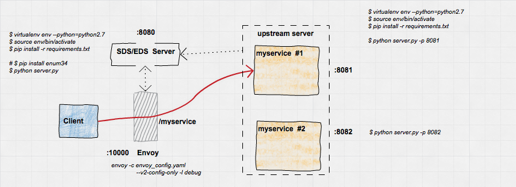

# Envoy EDS "hello world"
A simple app demonstrating a small part of [Envoy's Endpoint Discovery Service](https://www.envoyproxy.io/docs/envoy/latest/api-v2/api/v2/eds.proto#envoy-api-file-envoy-api-v2-eds-proto).  THis is a sample walkthough of a trivial 
envoy config that sets up:

* Envoy with SDS bootstrap (both envoy ```v1``` and ```v2``` APIs)
* SDS Server to provide service discovery info for upstream back to Envoy
* N upstream instances envoy will proxy back.


Some of the configurations are hardcoded in the ```envoy_config.yaml``` file just as a demonstration.  Specifically, the service, cluster and bootstrap endpoint
to get discovery information.

## References
 - [Endpoint Discovery Service](https://www.envoyproxy.io/docs/envoy/latest/api-v2/api/v2/eds.proto#envoy-api-file-envoy-api-v2-eds-proto)
 - [Endpoing Overview](https://www.envoyproxy.io/docs/envoy/latest/intro/arch_overview/service_discovery#arch-overview-service-discovery-types-sds)
 - [SDS at Lyft](https://github.com/lyft/discovery)
 - [Envoy Dynamic Configuration](https://www.envoyproxy.io/docs/envoy/latest/intro/arch_overview/dynamic_configuration.html)
 - [Envoy v2 API](https://github.com/envoyproxy/envoy/blob/master/docs/root/configuration/overview/v2_overview.rst#mostly-static-with-dynamic-eds)
 - [EDS v2 API Reference](https://www.envoyproxy.io/docs/envoy/latest/api-v2/api/v2/eds.proto)_
 - [Envoy API for developers](https://github.com/envoyproxy/data-plane-api/blob/master/API_OVERVIEW.md)

### Prerequsites

- [envoy binary](https://envoyproxy.io)
- python (and virtualenv)



---

## Start Envoy with SDS

Bootstraping SDS within Envoy is relatively simple:

```yaml
  - name: listener_0
    address:
      socket_address: { address: 0.0.0.0, port_value: 10000 }
    filter_chains:
    - filters:
      - name: envoy.http_connection_manager
        config:
          stat_prefix: ingress_http
        ...
        ...
              - match: { prefix: "/" }
                route: { cluster: service_backend }
          http_filters:
          - name: envoy.router
  clusters:
  - name: service_backend
    type: EDS  
    connect_timeout: 0.25s
    eds_cluster_config:
      service_name: myservice
      eds_config:
        api_config_source:
          #api_type: REST_LEGACY # GET /v1/registration/myservice
          #api_type: REST # POST /v2/discovery:endpoints
          api_type: REST
          cluster_names: [eds_cluster]
          refresh_delay: 5s
  - name: eds_cluster
    type: STATIC
    connect_timeout: 0.25s
    hosts: [{ socket_address: { address: 127.0.0.1, port_value: 8080 }}]
```

Note the ```api_type:``` is set to ```v2```  ```REST``` endpoint.  If you want to swtich to ```v1``` simply use ```api_type:  REST_LEGACY```

You can basically 'copy out an envoy binary from docker if you're using a linux flavor
```
$ mkdir /tmp/envoybin
$ docker run -v /tmp/envoybin/:/tmp/envoybin -ti envoyproxy/envoy /bin/bash
```

copy the envoy binary out and exit container
```
root@45e96404eb8a:/# cp /usr/local/bin/envoy /tmp/envoybin/
root@45e96404eb8a:/# exit
exit
```
find envoy outside now
```
$ ls /tmp/envoybin/envoy 
/tmp/envoybin/envoy
```

So start envoy with debug enabled:

```bash
envoy -c envoy_config.yaml --v2-config-only -l debug
```

At this point, envoy attempts to connect to the upstream EDS cluster at ```127.0.0.1:8080``` but since your SDS isn't running yet, nothing additional config takes place.

## Start Upstream services

Now in a new window, start the upstream service on a given the default port for the script (```:8081```)

```bash
cd upstream/

virtualenv env --python=python2.7
source env/bin/activate
pip install -r requirements.txt

$ python server.py -p 8081
```

Right now envoy doens't know aboutt his endpoint:


## Start SDS

Now start SDS without any bootstrapped config:

```bash
cd eds_server/

virtualenv env --python=python2.7
source env/bin/activate
pip install -r requirements.txt

# ImportError: No module named enum
# pip install enum34

python main.py
```

You should see the following output on SDS stdout indicating an inbound Envoy discovery request:

```
Inbound v2 request for discovery.  POST payload: {u'node': {u'build_version': u'fd44fd6051f5d1de3b020d0e03685c24075ba388/1.6.0-dev/Clean/RELEASE', u'cluster': u'mycluster', u'id': u'test-id'}, u'resource_names': [u'myservice']}
127.0.0.1 - - [29/Apr/2018 22:59:04] "POST /v2/discovery:endpoints HTTP/1.1" 200 -
```

then on the envoy proxy stdout, something like:

```bash
[2018-04-29 22:59:10.323][157796][debug][config] bazel-out/k8-opt/bin/source/common/config/_virtual_includes/http_subscription_lib/common/config/http_subscription_impl.h:67] Sending REST request for /v2/discovery:endpoints
[2018-04-29 22:59:10.323][157796][debug][router] source/common/router/router.cc:250] [C0][S636378528925215024] cluster 'eds_cluster' match for URL '/v2/discovery:endpoints'
[2018-04-29 22:59:10.323][157796][debug][router] source/common/router/router.cc:298] [C0][S636378528925215024]   ':method':'POST'
[2018-04-29 22:59:10.323][157796][debug][router] source/common/router/router.cc:298] [C0][S636378528925215024]   ':path':'/v2/discovery:endpoints'
[2018-04-29 22:59:10.323][157796][debug][router] source/common/router/router.cc:298] [C0][S636378528925215024]   ':authority':'eds_cluster'
...
[2018-04-29 22:59:10.324][157796][debug][client] source/common/http/codec_client.cc:52] [C2] connected
[2018-04-29 22:59:10.324][157796][debug][pool] source/common/http/http1/conn_pool.cc:225] [C2] attaching to next request
...
[2018-04-29 22:59:10.330][157796][debug][client] source/common/http/codec_client.cc:81] [C2] response complete
[2018-04-29 22:59:10.330][157796][debug][pool] source/common/http/http1/conn_pool.cc:200] [C2] response complete
...
[2018-04-29 22:59:10.331][157796][debug][pool] source/common/http/http1/conn_pool.cc:115] [C2] client disconnected
```

Basically, this shows no updates were recieved from the endpoint


You can verify that envoy doesn't know anything about this endpoint by attempting to connect through to it:

```bash
curl -v https://localhost:10000/
$ curl -v  http://localhost:10000/
... 
< HTTP/1.1 503 Service Unavailable
< content-length: 19
< content-type: text/plain
< date: Mon, 30 Apr 2018 06:06:20 GMT
< server: envoy
< 
* Connection #0 to host localhost left intact
no healthy upstreams
```

## Add endpoint to SDS

Now we're ready to add an upstream service configuration to the SDS server.  This sample uses ```Flask-RESTplus``` framework
which delivers a convenient API console (you can, ofcourse, use ```curl```)

connect to SDS servers UI console at:

```
http://localhost:8080/
```


From there, you can register a service endpoint by selecting ```POST``` and the default payload.


### Create Endpoint

Since we defined the service as ```myservice``` in the ```envoy_config.yaml```, we can 
need to register an endpoint against it:

```bash
curl -X POST --header 'Content-Type: application/json' --header 'Accept: application/json' -d '{
  "hosts": [
    {
      "ip_address": "127.0.0.1",
      "port": 18080,
      "tags": {
        "az": "us-central1-a",
        "canary": false,
        "load_balancing_weight": 50
      }
    }
  ]
}' http://localhost:8080/edsservice/myservice
```

What this will do is set some endpoints for ```myservice```. Now, envoy will query SDS for membership so on the next poll, you'll see some lines like:

```
[2018-04-29 23:18:02.360][159226][debug][upstream] source/common/upstream/eds.cc:105] EDS hosts changed for cluster: service_backend (0) priority 0
[2018-04-29 23:18:02.360][159231][debug][upstream] source/common/upstream/cluster_manager_impl.cc:642] membership update for TLS cluster service_backend
[2018-04-29 23:18:02.360][159226][debug][upstream] source/common/upstream/cluster_manager_impl.cc:642] membership update for TLS cluster service_backend
[2018-04-29 23:18:02.360][159233][debug][upstream] source/common/upstream/cluster_manager_impl.cc:642] membership update for TLS cluster service_backend
[2018-04-29 23:18:02.360][159234][debug][upstream] source/common/upstream/cluster_manager_impl.cc:642] membership update for TLS cluster service_backend
[2018-04-29 23:18:02.360][159232][debug][upstream] source/common/upstream/cluster_manager_impl.cc:642] membership update for TLS cluster service_backend
[2018-04-29 23:18:02.360][159226][debug][pool] source/common/http/http1/conn_pool.cc:200] [C7] response complete
[2018-04-29 23:18:02.360][159226][debug][pool] source/common/http/http1/conn_pool.cc:220] [C7] moving to ready
```

### Check client connectivity via envoy

Since we already started the upstream service above, you can connect to it via envoy:

```bash
$ curl -v  http://localhost:10000/
 
< HTTP/1.1 200 OK
< content-type: text/html; charset=utf-8
< content-length: 36
< server: envoy
< date: Mon, 30 Apr 2018 06:21:43 GMT
< x-envoy-upstream-service-time: 3
< 
* Connection #0 to host localhost left intact
40b9bc6f-77b8-49b7-b939-1871507b0fcc
```

(note the ```server: envoy``` part in the header)


### Delete Endpoint

Ok, so now we've dynamically added in an endpoint...lets remove it by the SDS server's custom API and emptying out its ```hosts: []```

```bash
curl -X PUT --header 'Content-Type: application/json' --header 'Accept: application/json' -d '{
  "hosts": [  ]
}' http://localhost:8080/edsservice/myservice
```

Now try the endpoint, you should see ```no healthy upstream``` message from envoy

```bash
$ curl -v  http://localhost:10000/
< HTTP/1.1 503 Service Unavailable
< content-length: 19
< content-type: text/plain
< date: Mon, 30 Apr 2018 06:23:40 GMT
< server: envoy
< 
* Connection #0 to host localhost left intact
no healthy upstream
```

## Rinse and repeat

Ok, you can continue to play with the endpoints by adding and removing new upstream services on differnet ports:

eg:
```
$ python server.py -p 8082
$ python server.py -p 8083
```
and then using the API to add hosts to the SDS server (use the ```PUT``` endpoint to do that)


### Healthcheck

A note about healthchecks:  I noticed that once i added in healthchecks to the endpoint, even if i deleted the upstream service
from the SDS server (i.,e removed it from ```hosts:``` list), the healthchecks continued and we can still connect to it via envoy.
Since i'm new to envoy config, i suspect this is working as intended..

```
    health_checks: 
      - timeout: 1s
        interval: 5s
        unhealthy_threshold: 1
        healthy_threshold: 1
        http_health_check: 
          path: /healthz
```

## Concolusion

I wrote this up just in an effort to play around with ```envoy``` i'm pretty much new to this so i likely have numerous 
misunderstanding on what i just did here...if you see something amiss, please do let me know.

